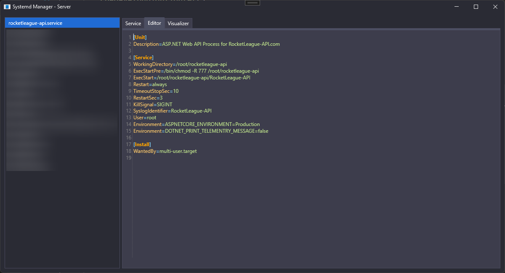

# SystemD Manager
A tool to easily manager, create and view all your systemd services.

### Features
 - ~~Service Controls (start, stop, restart)~~
 - ~~SSH Keys~~
 - ~~Create Services~~
   - ~~Templates~~
 - Console
   - ~~Live Update~~
 - Configuration Editor

### Images

### Contribution
Any type of contribution is much appreciated!
